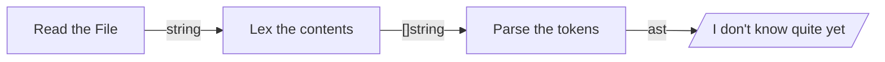

# Monkey Language Interpreter (*MLI*)

## Purpose

This interpreter is being made following Thorsten Ball's book
*"Writing an Interpreter in Go"*.

The purposes of this repo are purely educational and in no way are they meant
to copy or steal anyone's work.

No changes are going to be made to the structure of the program itself nor to
the reference language it is addresing (I may try to change `char` into `rune`
to provide support for utf-8 at some point, though).

## Structure

The structure and *"workflow"* of the interpreter is as presented in the book:

